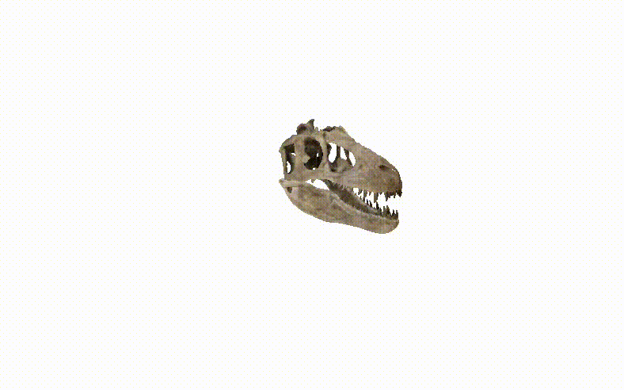

---

# 🚀 3D Model Viewer (Aeromine Project)

This project is a **web-based 3D model viewer** built with [Three.js](https://threejs.org/) and [Vite](https://vitejs.dev/).
It allows you to load, explore, and interact with 3D models directly in the browser — no additional software required.

👉 Developed as a client project for **[Aeromine](https://www.aeromine.com/)**.

---

## ✨ Features

* 🔄 **Interactive controls** — rotate, zoom, and pan around the model with smooth orbit controls.
* 💡 **Realistic lighting** — ambient and directional light for clear visibility.
* 📦 **GLTF/GLB model support** — optimized for modern 3D formats.
* 🎯 **Auto-scaling & centering** — models are automatically resized and centered in the scene.
* ⚡ **Fast & lightweight** — powered by Vite for modern, blazing-fast builds.

---

## 📸 Preview


---

## 🎥 Demo Video

See the 3D viewer in action:




---

## 🛠️ Tech Stack

* **Three.js** → 3D rendering engine
* **GLTFLoader** → loads 3D assets
* **OrbitControls** → user-friendly navigation
* **Vite** → modern development & build tool

---

## 📂 Project Structure

```
├── index.html       # Main HTML file
├── main.js          # JavaScript entry point (Three.js logic)
├── package.json     # Dependencies & scripts
├── public/          # Static assets (models, textures, etc.)
│   └── Models/
│       └── dino/scene.gltf
└── ...
```

---

## 🚀 Getting Started

### 1. Clone the repo

```bash
git clone https://github.com/yourusername/Aeromine-Interactive-3D-Viewer.git
cd Aeromine-Interactive-3D-Viewer
```

### 2. Install dependencies

```bash
npm install
```

### 3. Run in development mode

```bash
npm run dev
```

Open [http://localhost:5173](http://localhost:5173) in your browser.

### 4. Build for production

```bash
npm run build
```

The production-ready files will be generated in the `dist/` folder.

---

## 📖 Usage

* Drag with your **mouse** to rotate the model.
* Scroll to **zoom in/out**.
* Right-click + drag to **pan the view**.

---

## 👨‍💻 Author

Developed by **Vasileios** for **Aeromine** ✨

📧 Contact: https://www.linkedin.com/in/vasilis-kokotakis/

---

## 📜 License

This project was developed for **Aeromine** and is provided as reference code.
For commercial or extended use, please contact the author.

---

👉 The only missing piece is the **actual video link or file**. Do you want me to show you how to **record your screen + upload to YouTube (unlisted)**, so you can just paste the link in?


